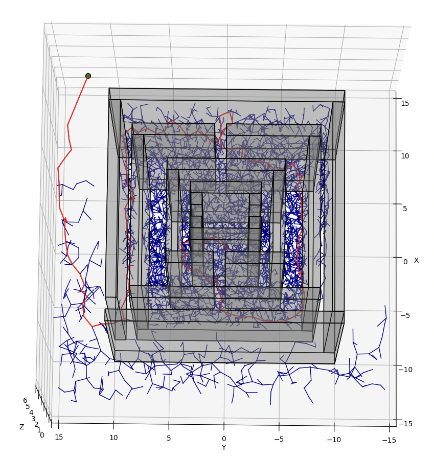

# ECE276B PR2 Spring 2024 - Motion Planning

## Overview
In this project, we will focus on search-based and sampling-based motion planning algorithms in 3-D Euclidean space. We will test both search-based and sampling-based motion planning algorithms in 7 different environments with obstacles that are axis-aligned bounding boxes (AABBs). 

[Report of the project](https://drive.google.com/file/d/15PmhiIm68NDd3kgRTn9EB6amDcqkDHKF/view?usp=sharing)


#### A* (Top Left and Right) and Weighted A* (Bottom Left and Right) in different test scenarios

<div align="center">
    
    
</div>
<div align="center">
    
    
</div>

#### A* path planning algorithm in different test scenarios

<div align="center">
    
    
</div>    
<div align="center">
    
    
</div>


#### RRT in Window and Maze Environments (Top Left, Top Right), RRT* in Window and Maze Environments (Bottom Left, Bottom Right)

<div align="center">
    
    
</div>
<div align="center">    
    
    
</div>

#### Bi-Directional RRT* path planning algorithm in different test scenarios

<div align="center">
    
    
    
</div>
<div align="center">
    
    
    
</div>


# How to use
## Searh-based method - A*
```
python astar_main.py single_cube --epsilon 1
```
## Weighted A*
```
python astar_main.py single_cube --epsilon 1.5
```
## Sampling-based method 
- RRT*
- RRT-connected
- Bidirectional RRT* (default)
- RRT 
```
python rrt_main.py --test_case maze
```
## For the Maze Case you might want to increase max sample size:
```
python rrt_main.py --alg rrt_star --test_case maze --max_samples 100000

```